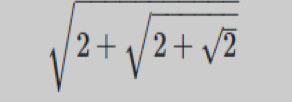
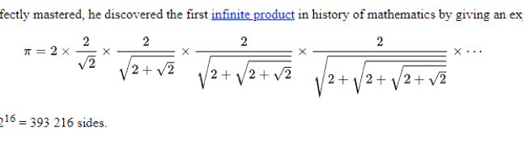
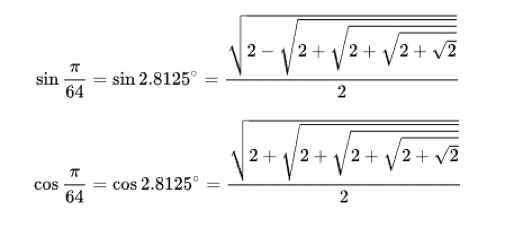
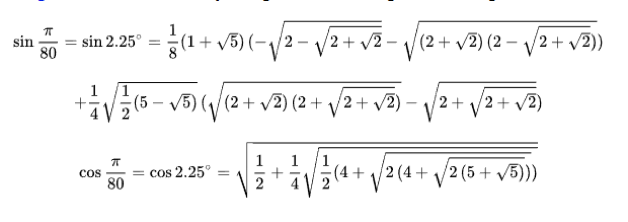

# Math Formula Retrieval 

This repo contains front-end and backend of math formula retrieval system including text and formula index building and searching.

## Project Structure

* [Math-search-front](https://github.com/dengpenn/Math-Formula-Retrieval/tree/master/Math-search-front) includes front-end of our system using Angular JS.
* Lucene was used for building index and ranking documents(TF-IDF Model).
* Math formula(Latex format) was parsed as XML and the tree sub-structure was built on it, detailed information can be found in [formula-server](https://github.com/dengpenn/Math-Formula-Retrieval/tree/master/formula-server).

## Motivation

* Mathematical formulae are important means for dissemination and communication of scientific information.
* Non-alphabetical symbols that are not understood by current search systems.
* Terms are either meaningless or improperly read and processed by current systems; e.g. 
* Current search systems are not equipped to recognize those structure when searching.

## Method

* We treat every formula inside documents as single indexed file. 
* The ranking algorithms is . . It indicated the matched level between the indexed formula and searched  formula.

## Demo

### Searched Formula

### Matched Top3 Formula

#### Rank1

#### Rank2

#### Rank3

## Contributor

[Deng Pan](<https://github.com/dengpenn>)

[Yuchen Deng](<https://github.com/lethelimited>)

[Sichao Xue](<https://github.com/xuesichao>)

## Reference 

Gao, Liangcai, et al. "The Math Retrieval System of ICST for NTCIR-12 MathIR Task." *NTCIR*. 2016.